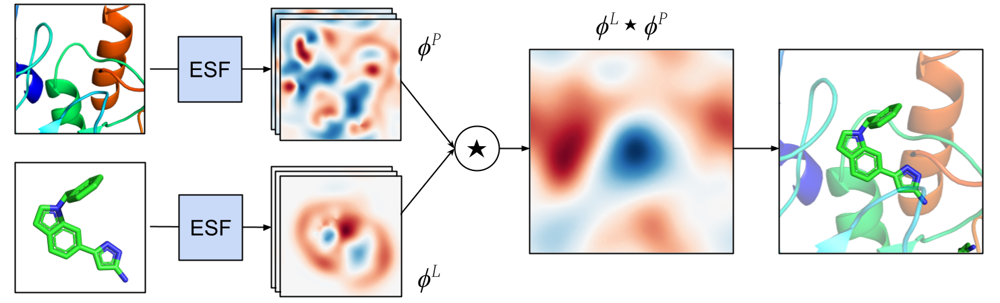

# ESF&mdash;Equivariant Scalar Fields

Implementation of [Equivariant Scalar Fields for Molecular Docking with Fast Fourier Transforms](https://arxiv.org/abs/2312.04323) by Bowen Jing, Tommi Jaakkola, Bonnie Berger.

ESF is an ML-based ligand pose scoring function designed for rapid optimization over rigid-body degrees of freedom. The scoring function is the cross-correlation of multi-channel ligand and protein scalar fields parameterized by equivariant graph neural networks. These cross-correlations can be rapidly evaluated over the space of translations or rotations with Fast Fourier Transforms (FFT), enabling the score to be immediately maximized over either degree of freedom without optimization or sampling algorithms.

Please contact bjing@mit.edu with any comments or issues.



## Installation
```
conda create -c conda-forge -n [name] rdkit pymol-open-source python=3.10.9
pip install torch==1.11.0+cu113 -f https://download.pytorch.org/whl/torch_stable.html
pip install torch-scatter==2.1.0 torch-sparse==0.6.16 torch-cluster==1.6.0 torch-geometric==2.2.0 -f https://data.pyg.org/whl/torch-1.11.0+cu113.html
pip install e3nn==0.5.1 networkx spyrmsd biopython biopandas jupyterlab pytorch_lightning==2.0.3 pillow==9.4.0
```
Then, download and/or install [Gnina](https://github.com/gnina/gnina) and [OpenBabel](https://openbabel.org/docs/dev/Installation/install.html) to your `PATH`.

Download the PDBBind processed dataset from [St&auml;rk et al., 2022](https://zenodo.org/record/6034088) and unzip the files to `./data/PDBBind_processed`. Then download the ESMFold structures of the test set from [Corso, et al., 2023](https://zenodo.org/record/7778651) and move them to the corresponding directories, i.e. with paths `./data/PDBBind_processed/{pdb_id}/{pdb_id}_protein_esmfold_aligned_tr.pdb`.

To download the PDE10A dataset, run:
```
python -m scripts.fetch_pde10a
```
Then align the PDE10A ligands to the `5SFS` protein structure:
```
python -m scripts.align_pde10a
```

Finally, for both datasets prepare the rigid conformers for docking:
```
python -m scripts.prep_ligands pdbbind
python -m scripts.prep_ligands pde10a
```

To generate a dataset of PDBBind decoy poses for the test split, run:
```
python -m scripts.make_decoys --num_workers [N]
```
The generated decoy poses are nondeterministic. To exactly reproduce our experimental results, the poses used in our paper are available upon request (~41G).

## Paper results
All tables and figures in the paper are obtained from notebooks in `./notebooks` using the outputs in `./paper_results`.
* `main_tables.ipynb` reproduces the tables in the main text. Some cells depend on decoy scoring results, which are omitted from the repository and are available upon request (~4.2G).
* `appendix.ipynb` reproduces the tables and most figures in the Appendix.
* `figures.ipynb` reproduces the visualizations of structures and scalar fields.

## Re-running inference

Our pretrained checkpoints are available at `./model_checkpoints/{ESF, ESF_N}.ckpt` for the ESF and ESF-N models, respectively.

To re-run decoy scoring with ESF:
```
python score_poses.py --mode T --ckpt ./model_checkpoints/ESF.ckpt --outdir results/scoring/ESF/TS_pdbbind
python score_poses.py --mode R --ckpt ./model_checkpoints/ESF.ckpt --outdir results/scoring/ESF/RS_pdbbind
```
and similarly for ESF-N. To use ESMFold structures, append `--esmfold`. 

To run the Gnina baselines on decoy scoring:
```
# Vina scoring function
python3 gnina_scoring.py --outdir results/scoring/vina/pdbbind --outcsv results/scoring/vina/pdbbind.csv
# Gnina scoring function
python3 gnina_scoring.py --scoring gnina --outdir results/scoring/gnina/pdbbind --outcsv results/scoring/gnina/pdbbind.csv
```
To use ESMFold structures, append `--receptor_suffix protein_esmfold_aligned.pdb`.

To re-run conformer docking with ESF:
```
# PDBBind
python inference.py --mode T --so3_grid_resolution 2 --fft_scaling 1 --ckpt ./model_checkpoints/ESF.ckpt --outjson results/docking/ESF/pdbbind/T_grid2_scaling1.json 
python inference.py --mode R --box_grid_count 9 --fft_lmax 25 --ckpt ./model_checkpoints/ESF.ckpt --outjson results/docking/ESF/pdbbind/R_box9_lmax25.json
# PDE10A
python run_pde10a.py --mode T --so3_grid_resolution 2 --fft_scaling 1 --ckpt ./model_checkpoints/ESF.ckpt --outjson results/docking/ESF/pde10a/T_grid2_scaling1.json
python run_pde10a.py --mode R --box_grid_count 9 --fft_lmax 25 --ckpt ./model_checkpoints/ESF.ckpt --outjson results/docking/ESF/pde10a/R_box9_lmax25.json
```
and similarly for ESF-N. To use ESMFold structures, append `--esmfold` (PDBBind only). Note that our experiments also vary the values of `--so3_grid_resolution`, `--fft_scaling`, `--box_grid_count`, and `--fft_lmax`.

To run the Gnina baselines on conformer docking (on PDBBind):
```
# Vina scoring function
python3 gnina_inference.py --outcsv results/docking/gnina/pdbbind/default.csv
# Gnina scoring function
python3 gnina_inference.py --scoring gnina --outcsv results/docking/gnina/pdbbind/gnina.csv
# No-op time control
python3 gnina_inference.py --score_only --outcsv results/docking/gnina/pdbbind/score_only.csv
```
To use ESMFold structures, append `--esmfold`. To run on PDE10A, append the arguments
```
--pdbbind_dir data/pde10a --splits splits/pde10a --common_receptor data/pde10a/5sfs/5sfs_protein_processed.pdb --common_autobox data/pde10a/5sfs/5sfs_ligand.sdf --ref_suffix ligand_aligned.sdf
```
Note that our experiments repeat the above commands with the additional flags `--max_mc_steps 5` and `--minimize_iters 5` individually and in combination.

## Retraining the model
To retrain the ESF model:
```
python train_pl.py --num_rbf 5 --rbf_max 5 --mode mixed --all_atoms --run_name ESF
```
To retrain the ESF-N model:
```
python train_pl.py --num_rbf 5 --rbf_max 5 --mode mixed --rot_noise 0.2 --tr_noise 0.7 --all_atoms --run_name ESF_N
```
Both models are trained for 10 epochs on a single GPU.

## Citation
```
@misc{jing2023equivariant,
      title={Equivariant Scalar Fields for Molecular Docking with Fast Fourier Transforms}, 
      author={Bowen Jing and Tommi Jaakkola and Bonnie Berger},
      year={2023},
      eprint={2312.04323},
      archivePrefix={arXiv},
      primaryClass={q-bio.BM}
}
```
